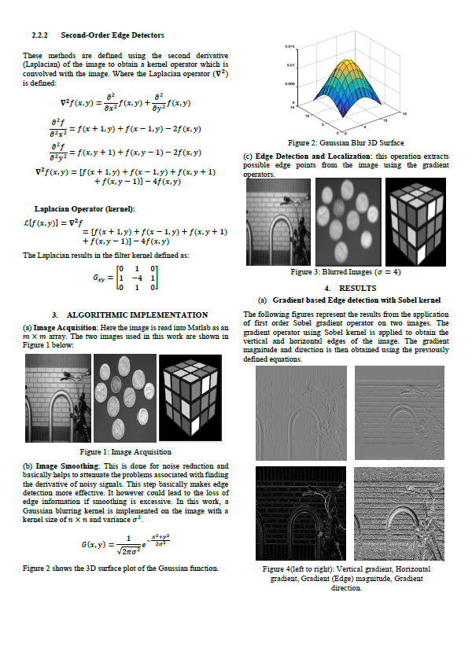
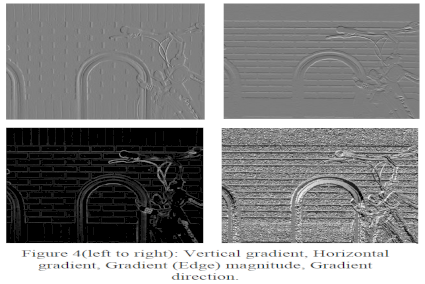

# Edge Detection

## Introduction

Basic algorithms in Image processing. Using Matlab code to explore different Edge detection algorithms and parameters. 
  

## Description  
  

## Results
Edge detection:  

